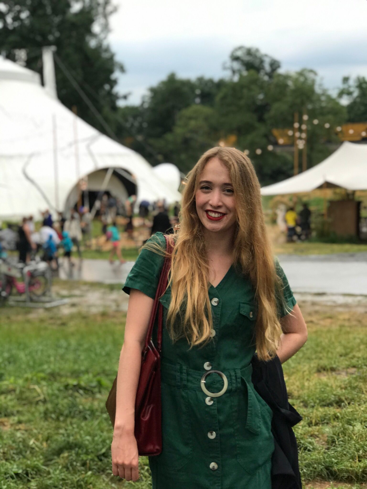

# Natalie Nevrelova

## About

I am a third-year BSc Psychology student at the [University of Lincoln](https://www.lincoln.ac.uk/home/) currently working on a multistudy paper under the supervision of [Dr Ross Bartels](https://staff.lincoln.ac.uk/6f30c874-4460-4ecf-99d5-621467905cde) and [Dr Mark Gresswell](https://staff.lincoln.ac.uk/mgresswell). For the past two years, my research focus has been on the modern-day courtship of young adults to establish a baseline of typical courting behaviours of adults aged 18 - 25 years.

Dating has evolved due to the influence of social media and technology advancements to become faster and more user-friendly to suit the needs of the modern age lifestyle. I believe there will be a shift in what typical courtship looks like now, which should redefine several atypical courting behaviours like stalking, abusive domestic tendencies or controlling behaviours.

I have worked on several projects across several psychological fields, including forensic psychology, social psychology, behavioural economics, neuropsychology, developmental psychology, cognitive psychology and health psychology. Out of my experiences, the most influencing has been my internship at the Childrens' Psychiatric Hospital Louny in my motherland the Czech Republic, along with my internship at CEITEC and volunteering and teaching at Summer Academy Discover.

In my work I always strive to have a balance of research and applied psychology, which is why I aim to have most of my research directly applicable to clinical or non-clinical populations. My long-term goal is to design research and teach while working with a clinical population in an applied setting.

